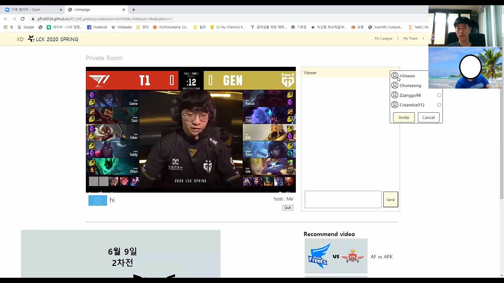
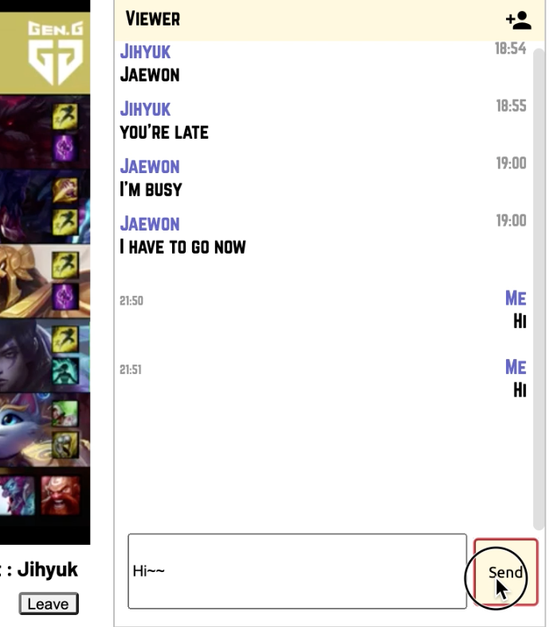

# [Team XD] DP5: Usability Testing
 
## Members
 
- 20150145 Kim SangUk
 
- 20170361 Shin Yourim
 
- 20170490 Lee Jaejun
 
- 20180693 Choi Junyoung
 
## :page_with_curl: Written Protocol

### Preparation and setting

- For online test, use online session tool that supports screen sharing(Zoom, Google Hangout, ...), so that you can monitor the user's screen. Provide appropriate session URL to our user.
- FYI, development resources and data is in the following git repository URL, https://github.com/gfhd0054/XD_hifi_proto.git.
- Provide test URL to our user. Use Chrome browser. There is no additional data load to user's local.

:link: Test URL : https://gfhd0054.github.io/XD_hifi_proto/

### Introduction and informed consent
We are *Team XD* that develops the platform where you can enjoy the league games of League of Legends. Thank you for participating our user test. We would be glad if you proceed 3 tasks in our website and have a short interview afterwards. If you don't mind, we will record your voice and screen. What we record will be deleted right after we analyze the result. If you don't want to be recorded please let us know. During the test, please think aloud. “Think aloud” is speaking what you think or feel immediately while doing some action. Even though you have any small thing curious or stuck, feel free to ask for it. Any comments would be helpful. Before diving into our page, here are some assumptions. It is 2020. 06. 09 and LOL match is ongoing. You already have a membership about our page, so sign up step is skipped. You are already logged in, and you have some online friends in there.

### Tutorials
This is a tutorial session for test. Get a taste of the main page. We have many elements in here. Don’t forget you are already logged in.

### Task lists
1. **Task1** : Watch live match in the ‘private room’ with your friends. 
2. **Task2** : Go to the official streaming. Enjoy it and take a pop-up game.
3. **Task3** : Watch the replay video [2020. 06. 07 DRX vs DWG set1].
 
### Instructions
This prototype allows some level of users' freedom, but some features are not supported than shown in the screen. You may do what you want to do freely, but don't forget there is some only-visual elements. If stuck with some buggy situation or find a critical error, ask to facilitator anytime. If you stuck during the tasks, some detailed instructions for each tasks are here, so feel free to see it.
1. **Task1** : You can host your own new private room for watching match by "Create room" button on "Private room" menu. Invite your friend by clicking the icon on the right-upper corner of chatting slot.
2. **Task2** : Menu "Public Broadcast" direct you to official streaming. Calm and enjoy the streaming. Popup window would come out during the streaming, so participate to it.
3. **Task3** : There is list of the replay videos in the main page. Find DRX vs DWG set 1, which was held in 2020.06.07.
Go and watch it. There are timestamps for you to enjoy more.

### Recording strategy
We decided to utilize the screen/voice recording of online session tools. Make sure we had a consent for this recording.
- Facilitator (Sanguk Kim, Jaejun Lee, Junyoung Choi) : Focus on the comfort of user and smooth test flow. Also don't forget the formality of test.
- Observer (Yourim Shin) : Record the screen. Carefully observe the user's screen and memo the noticeable points. If some technical defects are found, also memo them. Take notes about the interviews. In having some questions, ask them directly or deliver them to facilitator.

### :clipboard: Questionnaires, Interview questions
1. User Information
    - How often do you consume LOL?
    - How do you usually consume your LOL games? (Playing or Watching League Game, Watching at Youtube etc)
    - Please describe your LOL experience as detail as possible.
    - Do you like the community for LOL?
    - Whom do you consume LOL with?

2. First Impression(After Tutorial)
    - Which functions did you notice?
    - How did you feel about main page?
3. UI/UX
    - Tell us how do you feel when you saw first screen.
    - What was difficult while you progress each task?
- Task1
    - How did you feel about this private room function?
    - (Special, outstanding behavior of user/ usability issue)
- Task2
    - How do you think about popup quiz?
    - Do you think popup quiz bothers you watching game?
    - (Special, outstanding behavior of user/ usability issue)
- Task3
    - Do you notice that timestamps have different color?
    - If you do, do you know what it means?
    - (Special, outstanding behavior of user/ usability issue)
4. Overall response
    - If there is a website like this, would you like to use it?
    - Which part do you think the website should be improved? 
    - Any comments or suggestions?

### Debrief prompt
Thank you very much for participating in our project user test. We are building a new enjoyable platform for watching the League of Legends league game with others and your test would be huge contribution.

## :mag: Session observations
#### Participants
|User|Sex|Age|Playing LoL|Watching LoL|Facilitator, Observer|
|:---:|:---:|:---:|:---:|:---:|:---:|
|:bust_in_silhouette: S|Male|23|2 hours a week|half hour a day|Sanguk Kim, Yourim Shin|
|:bust_in_silhouette: H|Male|24|7 hours a week|7 hours a week|Jaejun Lee, Yourim Shin|
|:bust_in_silhouette: C|Male|22|15 hours a week|watch 70% of LCK matches live with twitch|Junyoung Choi, Yourim Shin|

***All the participants were selected from the acquaintances of our team members.***

***Photo #1 (User S)***
User pointing out that there's no date information.

***Photo #2 (User S)***
User changing width of chrome page and checking response of division(structure).

***Photo #3 (User H)***
User criticizing about unreasonable feature of friend invitation.

***Photo #4 (User C) (It is an image reproduced after the incident.)***
User failed to send a chat by pressing enter key and eventually clicked button by mouse.

**Additional background / Session summary**
  - User S : He is spending in one direction without interacting, not actively working within the community, but only reading people's opinions. And he also watch league game alone at dinner. As he consume LoL half an hour/a day stedily, he noticed plenty of system status visibility problems.
  - User H : He doesn't like community and usually watches league with his friends. He pointed out somewhat unprofessional features on the page while testing.
  - User C : Unfortunately, he refused to record video, he answered very closely though. When he missed live, watch highlight video on youtube. Usually watches alone, but sometimes with his friends, especially at important match like final. By C's responses to tasks, our team could improve minor blanks discovered.

## :memo: Usability lessons

#### :heavy_minus_sign: Match the real world
1. Certain highlights are likely to be the highlight of both teams. (S) (Medium)
2. Tried to send message with pressing “enter” (C) (Medium)
3. **Expect league ranking on the main page. (S, C) (High)**
4. Use some metaphor of LOL game client, to send invitation. (H) (Low)

#### :heavy_minus_sign: User control & freedom
1. **It would be nice to have a button that can be submitted immediately (S) (High)**
2. Making new timestamp by user seems less intuitive. Offering candidate of timestamp from the website seems better. (C) (Low)
3. Expect the timestamp go back to smaller shape after clicking it. (C) (Low)

#### :heavy_minus_sign: Aesthetic design
1. Unnatural main page blocks (S) (Medium)
2. feel uncomfortable with position of private room. (C) (Medium)

#### :heavy_minus_sign: Visibility
1. Cannot notice it is timestamp at first.(H) (Medium)
2. Expect pop-up quiz to be located in top or bottom of screen to less bother watching game. (C) (Medium)
3. clicking “like” seems little narrow (C) (Medium)
4. Expect friend invitation feature to be more visible. (S) (Medium)
5. Looked for both date and D-day display for upcoming schedule, and both result and date showing for past games. (S) (Medium)
6. Expect friend list appears on the main page, and also the first entrance to private room. (H) (Medium)

#### :heavy_minus_sign: Visibility of system status
1. Expect other users’ voting status. (S) (Low)
2. Expect in-game screenshot to be the thumbnails of private room. (S) (Medium)
3. The function of viewing past quizzes or voting results. (S) (Low)

#### :heavy_minus_sign: Other things
1. **Error Prevention** : **Cannot deactivate already invited friends. (H) (High)**
2. **Recognition rather than recall** : Expected more specific information(title, hints to contents) when hover on a timestamp. (H)

### :bulb: High-level reflections: 
**What did you overall learn from the user testing experience?**
1. A few number of participants may induce the gap between needs and solutions, since the thoughts of users in Needfinding step and User testing step can be different.
2. It's safe to conduct frequent user testing while developing, to reduce the gap between thoughts of users and developer before it gets too wide. We thought it would be really hard to edit implementation for almost completed prototype.
3. Users don't entirely focus on the tasks. They also consider their usual surfing experience and give us comments.
4. Users expect to have a real experience, even though what we provide is 'prototype' of it (not released version of it).
5. It's hard that users catch the intention of developer only by testing.

**What would you do differently for better results and insights?**
1. Include more users in the step of needfinding and user testing, in order to quantify and generalize their needs and corresponding solutions.
2. Conduct more user testing in the middle of development stage. Also, ask some opinions from user or designer before implement something.
3. For the elements non-relevant with tasks, consider them also importantly, and make them user-friendly.
4. Provide detailed explanation about situation/environment setting before user testing, so that users get closer to real experiences.
5. After user testing, discuss about the designers' intention and how the users actually felt about it. Get the weak points of implementation.

## :busts_in_silhouette: Studio Reflections
**Private room** : Making and inviting a room is intuitive, but looking and searching at a list of friends is not intuitive.

**Quiz** : Unless it comes up at an important moment, it won't disturb watching.

**Timestamp** : The color of the timestamp is noticeable, but the functions of the timestamp were not intuitive.

## :paw_prints: Plan for iteration
Since we have limited time, we will add features that will give users great satisfaction with even a slight change. And these features can be developed with a total of three directions: Aesthetic design, Visibility, User control.

**Aesthetic design**
1. Update main page background image
2. Layout that doesn't change depending on the size of the webpage

**Visibility**
1. Friend invitation update
2. Main page hovering event addition
3. Main page toolbar fix

**User control**
1. Send message with enter
2. Timestamps user create don't disappear
